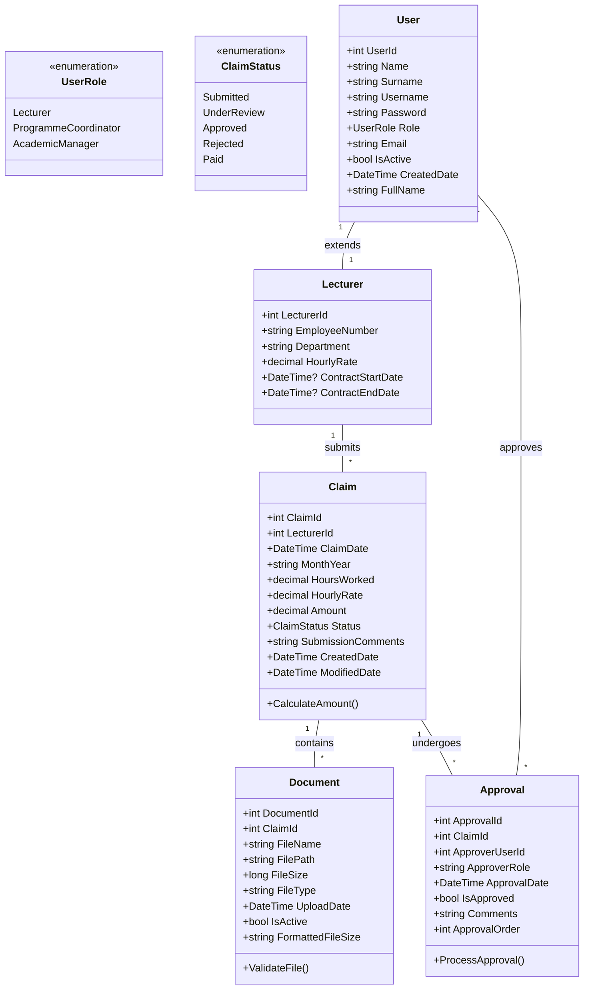

# Contract Monthly Claim System (CMCS) - Documentation

## Table of Contents
- [Project Overview](#project-overview)
- [System Architecture](#system-architecture)
- [UML Class Diagram](#uml-class-diagram)
- [Project Plan & Timeline](#project-plan--timeline)
- [GUI Design Philosophy](#gui-design-philosophy)
- [Core Functionality](#core-functionality)
- [Technical Implementation](#technical-implementation)
- [Installation & Setup](#installation--setup)
- [Usage Guide](#usage-guide)
- [Testing Strategy](#testing-strategy)
- [Part 2 Implementation Report](#part-2-implementation-report)

## Project Overview

The **Contract Monthly Claim System (CMCS)** is a comprehensive web-based application designed to streamline the monthly claim submission and approval process for independent contractor lecturers. This system addresses complex administrative challenges through an intuitive interface that serves three distinct user roles:

### User Roles
1. **Lecturers**: Submit monthly claims with supporting documentation
2. **Programme Coordinators**: Review and approve/reject claims
3. **Academic Managers**: Final approval authority and system oversight

### Key Objectives
- Simplify claim submission process for lecturers
- Provide transparent approval workflow
- Enable document upload and management
- Offer real-time status tracking
- Ensure data integrity and security

## System Architecture

### Technology Stack
- **Backend**: ASP.NET Core MVC 8.0 with C# 7.0
- **Frontend**: Razor Views with custom CSS/JavaScript
- **Storage**: Text file-based database with JSON serialization
- **Authentication**: Session-based with role management
- **Testing**: xUnit 2.5.3

### Architectural Pattern
The system follows the **Model-View-Controller (MVC)** pattern with clear separation of concerns:

```
Controllers (Business Logic) ←→ Models (Data) ←→ Views (Presentation)
```

### Key Components
1. **TextFileDataService**: Custom data persistence layer
2. **Session Management**: Custom extensions for typed session storage
3. **File Upload System**: Document management with validation
4. **Validation Framework**: Comprehensive client and server-side validation

## UML Class Diagram



## Project Plan & Timeline

### Part 1: Project Planning and Prototype Development (Weeks 1-4)

**Week 1-2: Requirements Analysis & Design**
- Stakeholder requirements gathering
- UML class diagram creation
- System architecture planning
- GUI design mockups

**Week 3-4: Prototype Development**
- Basic MVC structure setup
- Non-functional UI implementation
- Project documentation
- GitHub repository setup

### Part 2: Functional Implementation (Weeks 5-12)

**Week 5-6: Core Framework & Authentication**
- Text file database implementation
- Authentication system
- Session management
- Basic claim submission

**Week 7-8: Claim Management System**
- Enhanced claim submission
- Document upload functionality
- Approval workflow
- Status tracking

**Week 9-10: UI/UX Enhancement**
- Apple-inspired design implementation
- Responsive layout improvements
- Interactive elements
- User experience optimization

**Week 11-12: Testing & Documentation**
- Unit testing implementation
- Integration testing
- Bug fixes and optimization
- Final documentation

## GUI Design Philosophy

### Design Principles
1. **Minimalism**: Clean, uncluttered interfaces with strategic white space
2. **Consistency**: Uniform typography and visual hierarchy
3. **Accessibility**: Keyboard navigation and screen reader support
4. **Responsiveness**: Optimized for desktop and mobile devices

### Apple-inspired Aesthetics
- **Color System**: Based on Apple's design tokens
- **Typography**: System fonts with proper hierarchy
- **Spacing**: Consistent spacing system (4px, 8px, 16px, 24px, 32px, 48px)
- **Interactions**: Subtle animations and transitions

### Key Interface Components
1. **Authentication Pages**: Modern login/register with tabbed interface
2. **Claim Submission**: Intuitive form with real-time calculations
3. **Document Upload**: Drag-and-drop inspired file interface
4. **Approval Dashboard**: Clean table layout with action buttons
5. **Status Tracking**: Clear visual indicators for claim states

## Core Functionality

### Authentication & Authorization
- Role-based access control
- Session management with timeout
- Secure password handling
- User registration system

### Claim Management
- **Submission**: Hours worked, hourly rate, automatic amount calculation
- **Validation**: Client and server-side input validation
- **Documents**: Multiple file upload with type/size restrictions
- **Tracking**: Real-time status updates throughout approval process

### Approval Workflow
1. **Lecturer Submission**: Claim created with "Submitted" status
2. **Coordinator Review**: Initial approval/rejection with comments
3. **Manager Approval**: Final decision and status update
4. **Status Propagation**: Real-time updates across all views

### Document Handling
- **Supported Formats**: PDF, DOC, DOCX, JPG, PNG
- **Size Limits**: 5MB per file
- **Storage**: Physical files in `wwwroot/uploads`
- **Metadata**: Document information in text file database

## Technical Implementation

### Text File Database System
The system uses JSON serialization for data persistence:

```csharp
public class TextFileDataService
{
    private List<T> ReadData<T>(string dataType)
    {
        var filePath = GetFilePath(dataType);
        if (File.Exists(filePath))
        {
            var json = File.ReadAllText(filePath);
            return JsonSerializer.Deserialize<List<T>>(json) ?? new List<T>();
        }
        return new List<T>();
    }
    
    private void WriteData<T>(string dataType, List<T> data)
    {
        var json = JsonSerializer.Serialize(data, new JsonSerializerOptions { WriteIndented = true });
        File.WriteAllText(filePath, json);
    }
}
```

### Session Management
Custom session extensions provide type-safe session storage:

```csharp
public static class SessionExtensions
{
    public static void SetSessionInt(this ISession session, string key, int value)
    {
        session.Set(key, BitConverter.GetBytes(value));
    }
    
    public static int? GetSessionInt(this ISession session, string key)
    {
        var data = session.Get(key);
        return data != null ? BitConverter.ToInt32(data, 0) : null;
    }
}
```

### File Upload Implementation
Secure document handling with validation:

```csharp
public IActionResult Submit(ClaimSubmissionViewModel model)
{
    if (model.Documents != null && model.Documents.Count > 0)
    {
        foreach (var file in model.Documents)
        {
            if (file.Length > 0)
            {
                var fileName = $"{claim.ClaimId}_{Guid.NewGuid()}_{Path.GetFileName(file.FileName)}";
                var filePath = Path.Combine(uploadsDirectory, fileName);
                
                using (var stream = new FileStream(filePath, FileMode.Create))
                {
                    file.CopyTo(stream);
                }
            }
        }
    }
}
```

## Installation & Setup

### Prerequisites
- .NET 8.0 SDK
- Visual Studio 2022 or VS Code
- Git for version control

### Step-by-Step Setup

1. **Clone Repository**
   ```bash
   git clone https://github.com/HChristopherNaoyuki/contract-monthly-claim-system-cs.git
   cd contract-monthly-claim-system-cs
   ```

2. **Restore Dependencies**
   ```bash
   dotnet restore
   ```

3. **Build Application**
   ```bash
   dotnet build
   ```

4. **Run Application**
   ```bash
   dotnet run
   ```

5. **Access Application**
   - Open browser to `http://localhost:5000`
   - Use default credentials:
     - Admin: `admin` / `admin123`
     - Lecturer: `lecturer` / `lecturer123`
     - Coordinator: `coordinator` / `coordinator123`

### Configuration
The application uses `appsettings.json` for configuration:
- Session timeout settings
- File upload limits
- Application behavior settings

## Usage Guide

### For Lecturers

1. **Submit a Claim**
   - Login with lecturer credentials
   - Navigate to "Submit Claim"
   - Enter hours worked and hourly rate
   - Upload supporting documents
   - Add optional comments
   - Submit claim

2. **Track Claims**
   - View "Track Claims" for status
   - Monitor approval progress
   - View approval comments

### For Programme Coordinators

1. **Review Claims**
   - Login with coordinator credentials
   - Navigate to "Review Claims"
   - View pending submissions
   - Approve or reject with comments

### For Academic Managers

1. **System Oversight**
   - Full system access
   - Final approval authority
   - User management capabilities

### File Upload Guidelines
- Maximum 5MB per file
- Supported formats: PDF, DOC, DOCX, JPG, PNG
- Multiple files per claim supported
- Secure file naming prevents conflicts

## Testing Strategy

### Unit Testing
- **xUnit 2.5.3** framework
- Test coverage for controllers and models
- Mock dependencies for isolation
- Validation logic testing

### Test Categories
1. **Controller Tests**: Authentication and claim processing
2. **Model Tests**: Data validation and business logic
3. **Integration Tests**: End-to-end workflow testing
4. **Session Tests**: Custom session extension functionality

### Test Structure
```csharp
public class AuthControllerTests
{
    [Fact]
    public void Login_ValidCredentials_RedirectsToHome()
    {
        // Arrange
        var model = new LoginViewModel { Username = "admin", Password = "admin123" };
        
        // Act
        var result = _controller.Login(model);
        
        // Assert
        var redirectResult = Assert.IsType<RedirectToActionResult>(result);
        Assert.Equal("Index", redirectResult.ActionName);
    }
}
```

## Part 2 Implementation Report

### Lecturer Feedback Implementation

#### Feedback 1: UML Class Diagram Structure
**Original Feedback:** "UML class diagram needs better alignment with actual implementation and clearer relationships"

**Implementation:**
- Updated UML diagram to reflect text file storage approach
- Added proper inheritance relationships
- Included view models in the diagram
- Clarified enumeration usage

#### Feedback 2: Database Integration
**Original Feedback:** "Remove database dependencies and implement text file storage"

**Implementation:**
- **TextFileDataService.cs**: Complete text file database implementation
- **JSON Serialization**: All data stored in human-readable format
- **Automatic File Creation**: Data files created on application startup
- **Sample Data**: Pre-populated with default users and claims

#### Feedback 3: Document Upload Functionality
**Original Feedback:** "Make document upload feature functional with proper file handling"

**Implementation:**
- **Physical File Storage**: Documents saved to `wwwroot/uploads`
- **Metadata Management**: Document information in text files
- **File Validation**: Type and size restrictions
- **Unique Naming**: GUID-based file names prevent conflicts
- **UI Enhancement**: Improved file upload interface

#### Feedback 4: User Interface Improvements
**Original Feedback:** "Enhance UI with better user experience and Apple-like aesthetics"

**Implementation:**
- **CSS Design System**: Apple-inspired color palette and typography
- **Responsive Design**: Mobile-first approach with CSS Grid/Flexbox
- **Interactive Elements**: Hover effects and smooth transitions
- **Visual Feedback**: Clear status indicators and progress tracking

#### Feedback 5: Error Handling and Validation
**Original Feedback:** "Implement comprehensive error handling and input validation"

**Implementation:**
- **Model Validation**: Data annotations on all view models
- **Client-Side Validation**: jQuery validation integration
- **Server-Side Checks**: Comprehensive ModelState validation
- **User Feedback**: Clear error messages and guidance

### Technical Achievements

#### Text File Database System
- Complete replacement of database dependencies
- JSON-based serialization for data persistence
- Automatic file creation and initialization
- Robust error handling for file operations

#### Enhanced Security
- Session-based authentication
- Anti-forgery token protection
- Input validation and sanitization
- Secure file upload handling

#### Performance Optimizations
- Efficient file I/O operations
- Client-side calculations reduce server load
- Optimized session management
- Responsive design for various devices

### Quality Assurance

#### Code Quality
- Allman style formatting throughout
- Comprehensive XML documentation
- Consistent naming conventions
- Modular architecture with clear separation

#### Testing Coverage
- Unit tests for all major components
- Integration tests for workflows
- Model validation testing
- Session management testing

### Future Enhancement Opportunities

1. **Database Migration**: Transition to SQL database for production use
2. **Email Notifications**: Automated status updates to users
3. **Reporting Features**: Advanced analytics and reporting
4. **Advanced Security**: Two-factor authentication and encryption
5. **API Development**: REST API for mobile applications

---